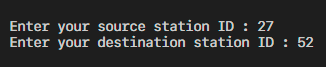
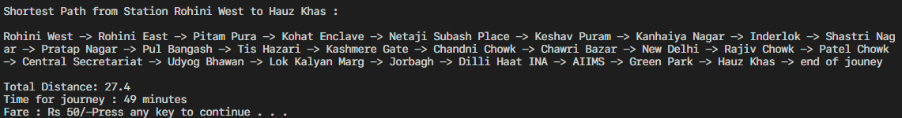

# Delhi-Metro-Route-Tracker

<strong>Delhi Metro Navigation Program </strong>
 
This program facilitates navigation through delhi metro system by utilizing a graph-based data structure. To execute the program, simply run the code on any Integrated Development Environment (IDE) with C++ extensions installed.
 
Overview The core data structure employed in this program is a graph, which models the interconnected metro stations and their relationships. The objective is to determine the shortest route between two specified locations, considering distance.

<b>INPUT:</b>

 
<b>OUTPUT:</b>

